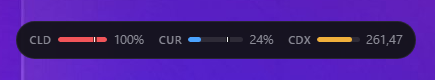
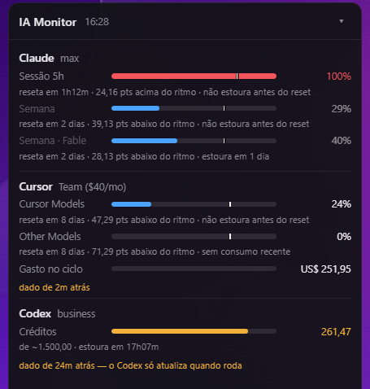

# IA Monitor

Monitor unificado de consumo de IA no Windows: **Claude Code**, **Cursor** e
**ChatGPT Codex** numa única pílula flutuante que expande em card.

Inspirado em [usage-monitor-for-claude](https://github.com/jens-duttke/usage-monitor-for-claude),
que resolve o problema só para o Claude.

<p align="center">
  
</p>

Clique na pílula para expandir o card:

<p align="center">
  
</p>

## Contribuindo

A `main` é protegida: PR obrigatório, o check `testes` precisa passar, e não
se apaga nem se força push na branch. Quem contribui de fora abre um fork e
manda PR.

O dono do repositório passa direto — `enforce_admins` está desligado. Isso é
deliberado: a proteção existe para evitar que alguém quebre a `main` sem
revisão, não para criar burocracia num projeto de uma pessoa só. A
contrapartida é honesta: com o bypass ligado, quem tem admin também escapa da
trava de force-push.

```
git tag v0.1.1 && git push origin v0.1.1   # publica um release
```

O `ci.yml` roda em todo push e PR; o `release.yml` só em tag.

## Ligar e desligar provedores

No menu da bandeja, em **Provedores**, cada um tem sua marca. Quem não tem
uma das três assinaturas desliga a que sobra e ela some da pílula, do card e
do ícone.

Não é só cosmético: um provedor desligado **para de ser consultado** e para de
ter o histórico lido. Com o Codex desligado, por exemplo, o app deixa de
consultar a API da OpenAI e de varrer `~/.codex/sessions`.

O que fica é o histórico já coletado — ele continua contando no painel de
projetos, porque o consumo aconteceu de verdade. Desligar esconde o status
atual, não reescreve o passado.

Desligar todos é um estado válido: a UI diz "nenhum provedor ativo" em vez de
aparecer vazia.

## Marcador de ritmo

Cada barra traz um traço vertical mostrando **onde o consumo estaria se
fosse uniforme ao longo da janela**. Barra à esquerda do traço = folga;
à direita = gastando mais rápido que o tempo passa.

```
Cursor Models  ███|░░░░░░░   16%      ← 68% do ciclo decorrido, 16% gasto
               reseta em 10 dias · 52 pts abaixo do ritmo

Sessão 5h      ██████|██░░   82%      ← 55% da janela decorrida, 82% gasto
               reseta em 1h10m (hoje às 14h) · 27 pts acima do ritmo
```

O marcador só aparece quando a duração da janela é **conhecida**, nunca
estimada:

| Fonte | Como a janela é conhecida |
|---|---|
| Cursor | exata — a resposta traz `billingCycleStart` **e** `billingCycleEnd` |
| Codex (licença de janela) | exata — `limit_window_seconds` vem na resposta |
| Claude | pelo vocabulário da própria API: os campos se chamam `five_hour` e `seven_day`, e `group` separa `session` de `weekly` |
| Codex (créditos) | **não existe** — saldo não reseta, então não há marcador |

Um `group` desconhecido no Claude também fica sem marcador: o limite continua
visível, mas sem uma referência inventada. Marcador chutado seria pior que
marcador nenhum, porque tem cara de fato.

## O problema que ele resolve

Três assinaturas, três noções incompatíveis de "quanto sobrou", nenhuma
avisando antes de estourar, e nenhuma resposta para "qual projeto está me
custando caro".

| | Unidade real | Reseta? | Origem da barra |
|---|---|---|---|
| Claude Max 5x | % de janela (5h e 7d) | sim, `resets_at` | servidor |
| Cursor Team | % do ciclo, 2 baldes | sim, `billingCycleEnd` | servidor |
| Codex Plus/Pro | % de janela (5h e 7d) | sim, `reset_at` | servidor |
| Codex Business | saldo de créditos | não (recarga manual) | derivada de baseline |

O Codex aparece duas vezes de propósito: é o único provedor onde **a licença
troca a unidade da conta**. Assinatura pessoal é governada por janela;
assinatura corporativa, por saldo de crédito.

**Regra de ouro: nunca recalcular o que o servidor já calculou.** A barra é o
número que a fonte devolve, então a UI acompanha mudanças de política de cota
sem alteração de código. A única exceção é o saldo de crédito, que não tem
teto declarado e por isso precisa de uma baseline.

## De onde vêm os dados

Nenhuma conta precisou de chave de admin — nem as corporativas, que expõem o
consumo do próprio usuário sem passar pelo painel do time. Vale para os dois
lados: a mesma leitura funciona numa assinatura pessoal.

### Claude Code — tempo real

`GET https://api.anthropic.com/api/oauth/usage`
Token de `~/.claude/.credentials.json` → `claudeAiOauth.accessToken`, com
`anthropic-beta: oauth-2025-04-20`.

O array `limits[]` é auto-descritivo e a UI renderiza direto dele. Atenção:
`is_active: false` **não** significa que o limite não existe — significa que
não é o que está governando o consumo agora. Filtrar por esse campo apaga as
barras semanais, que têm percentuais reais.

### Cursor — tempo real, duas APIs com auth diferente

**Medidor** — `POST https://api2.cursor.sh/aiserver.v1.DashboardService/GetCurrentPeriodUsage`
connect-rpc com `Authorization: Bearer <token>` e `connect-protocol-version: 1`.
É a mesma fonte da tela "Plan & Usage" da IDE (rastreada em
`workbench.glass.main.js` → `usageDataService.planUsage()`). Só o host
`api2.cursor.sh` roteia; `api3`/`api4` devolvem 404.
Campos: `planUsage.autoPercentUsed` (Cursor Models), `apiPercentUsed`
(Other Models), `billingCycleEnd`.

**Histórico** — `POST https://cursor.com/api/dashboard/get-filtered-usage-events`
Auth por **cookie** `WorkosCursorSessionToken` mais o header
**`Origin: https://cursor.com`** — sem o `Origin` a resposta é 403.

O token sai de `%APPDATA%\Cursor\User\globalStorage\state.vscdb`, aberto em
`mode=ro` via URI: o arquivo tem ~376 MB e o Cursor costuma estar rodando.
Medido em ~0 ms, sem cópia e sem lock.

> O Cursor **não guarda contagem de token localmente** — os registros de
> conversa no `state.vscdb` têm `tokenCount` zerado. A API é o único caminho.

### Codex — tempo real, com o disco de reserva

`GET https://chatgpt.com/backend-api/codex/usage`
Token de `~/.codex/auth.json` → `tokens.access_token`. O header
`chatgpt-account-id` é **obrigatório**: sem ele a resposta é 403.

```json
{"plan_type":"plus",
 "rate_limit":{"primary_window":{"used_percent":1,"limit_window_seconds":18000,
                                 "reset_at":1788895096},
               "secondary_window":{"used_percent":0,"limit_window_seconds":604800}},
 "credits":{"has_credits":false,"balance":"0"},
 "rate_limit_reached_type":null}
```

> Isto mede a cota do **Codex**, não a do chat do ChatGPT. Os limites do chat
> ficam atrás da sessão web e devolvem 403 para o token do Codex.

**Qual licença é essa?** A resposta está em `~/.codex/auth.json`, sem rede: o
`id_token` traz `chatgpt_plan_type` — e, em assinatura pessoal,
`chatgpt_subscription_active_until`, que vira o "até 08/10" ao lado do nome do
plano. Trocar de plano reescreve o arquivo, então a leitura nunca envelhece.

Isso é o que decide quais barras existem:

| Licença | Barras | O bloco que **não** vira barra |
|---|---|---|
| Plus / Pro | Sessão 5h + Semana | `credits`, que vem zerado |
| Business / Enterprise | Créditos | `primary`/`secondary`, que vêm nulos |

O `credits` zerado do Plus é uma armadilha real: ele existe na resposta, e a
regra ingênua "tem campo, mostra barra" pintaria 100% de consumo com a cota
intacta. Por isso o saldo só vira medidor quando de fato governa — tem
crédito, é ilimitado, ou o bloqueio veio por crédito.

**Reserva.** Sem rede ou com token vencido, o app cai no tail de
`~/.codex/sessions/AAAA/MM/DD/rollout-*.jsonl`, onde o CLI grava a cota que o
servidor devolveu a cada turno, e a UI passa a **dizer a idade** do dado.
Só que o rollout guarda o plano de quando foi gravado: quem migrou de
business para plus tem, no último arquivo, um saldo de crédito que não governa
mais nada. Então o recuo só é aceito quando o plano gravado bate com o plano
de agora — caso contrário a ferramenta mostraria a cota da assinatura errada
com cara de dado atual.

## Arquitetura

```
crates/core/          núcleo sem UI — testável isoladamente
  collect/            um coletor por provedor, atrás de um trait comum
  ingest/             backfill e leitura incremental do histórico
  store.rs            SQLite em %LOCALAPPDATA%\ia-monitor\
  analytics.rs        burn rate e projeção de esgotamento
  model.rs            Gauge normalizado
src-tauri/            shell Tauri 2: janela, bandeja, agendador, alertas
ui/                   HTML/CSS/JS puro, sem bundler
```

### Decisões que sustentam a performance

- **Nunca reler os logs inteiros.** São ~580 MB entre Claude e Codex. A
  leitura é incremental por offset de byte, persistido em `tail_cursor`. A
  segunda passada lê 0 bytes.
- **Ler o `state.vscdb` sem copiar.** `file:///...?mode=ro`, ~0 ms.
- **Ritmo adaptativo e por provedor.** Cada fonte tem seu próprio relógio:
  180 s ativo / 900 s ocioso, porque os três custam requisição — o Codex era
  mais rápido quando lia arquivo local, e entrou no mesmo ritmo ao virar
  consulta de API. Mais recuo exponencial por falha,
  recuo bem maior em 429 respeitando `Retry-After`, e um ciclo extra logo
  após cada reset conhecido — que é quando o número muda.
- **Cota de requisição é recurso.** O `GetPlanInfo` do Cursor fica em cache
  por 6 h, e uma trava entre execuções impede que abrir e fechar o app em
  sequência vire rajada. Em uso ativo dá ~62 requisições/hora nos três
  provedores — eram 186 só em Claude e Cursor na primeira versão, antes de o
  Codex passar a consultar API.
- **Uma janela só.** Pílula e card são a mesma janela redimensionada, não
  dois webviews.
- **UI sem timer.** O backend emite `snapshot` quando o dado muda.

### Sem framework no frontend

A tela tem duas visões e algumas barras. Um runtime de framework custaria
justamente no que se quer barato aqui: startup e memória de uma janela aberta
o dia inteiro. Também elimina `node_modules` e o passo de bundling — o build
é só `cargo tauri build`.

### Consumo medido (e onde a meta não foi atingida)

| | Medido | Meta do plano |
|---|---|---|
| CPU ocioso | **0,01%** (16 núcleos) | < 1% ✅ |
| Memória privada | **112 MB** | < 60 MB ❌ |
| Working set total | 379 MB | — |
| Executável | 5,3 MB | — |
| Instalador NSIS | 2,3 MB | — |

**A meta de memória não foi atingida e não é atingível com este shell.** O
WebView2 abre seis processos fixos (rede, storage, GPU, utilitário,
crashpad), independentemente de a página ser uma barra ou um editor. Reduzir
`additionalBrowserArgs` (GPU desligada, limite de renderer, features
desativadas) tirou ~64 MB do working set, mas o piso do runtime continua ali.

O número que importa é o **privado (112 MB)**: o working set conta as páginas
compartilhadas do runtime uma vez por processo, e boa parte delas é
compartilhada com qualquer outro app WebView2 da máquina.

Chegar aos 60 MB exigiria desenhar a janela nativamente (Win32/Direct2D) em
vez de usar um webview — outra arquitetura, não um ajuste.

## Quando uma fonte falha

Um provedor indisponível **não apaga os números dos outros nem os próprios**.
A última leitura boa continua na tela, com a idade e o motivo logo abaixo:

```
Sessão 5h      ████░░░░░░   40%
               limite de requisições atingido
               dado de 4m atrás — nova tentativa em 6m
```

Esconder o número seria pior: um valor de minutos atrás ainda orienta a
decisão. E a série temporal **não** recebe pontos repetidos nesse período —
regravar o mesmo valor com carimbo novo faria o burn rate enxergar consumo
parado, que é uma afirmação falsa.

A contagem de falhas é por provedor. Na primeira versão ela era global e
zerava se qualquer provedor respondesse, então um 429 no Claude continuava
sendo consultado a cada minuto enquanto Cursor e Codex funcionassem — a
receita para transformar um 429 pontual em permanente.

## Segurança

A ferramenta lê credenciais corporativas do disco. As regras:

- Tokens **nunca** são persistidos: lidos sob demanda, só em memória,
  limpos com `zeroize`.
- Rede restrita a `api.anthropic.com`, `api2.cursor.sh`, `cursor.com` e
  `chatgpt.com`. Zero telemetria.
- Somente leitura do próprio consumo. **Nunca** usa o `refresh_token` do
  Codex — a rotação invalidaria o token do CLI.
- Token do Claude expirado não é renovado por conta própria: a UI avisa para
  rodar o Claude Code.
- O webview não tem permissão de rede nem de arquivo; toda leitura de token
  acontece no Rust.

> Em máquina corporativa, vale confirmar a política da empresa antes de
> habilitar o autostart — o acesso é ao seu próprio consumo e é read-only,
> mas a ferramenta lê o token de sessão do Cursor.

## Uso

```bash
cargo tauri build          # gera o exe e o instalador NSIS
cargo tauri dev            # desenvolvimento
cargo run --bin probe      # medidores no terminal, sem UI
cargo run --bin backfill   # importa o histórico e mostra os totais
cargo test                 # 92 testes
```

Na bandeja: mostrar, pausar coleta, iniciar com o Windows, sair.
Clique na pílula expande; `Esc` recolhe.

A janela é ancorada pelo **canto inferior direito**: o card brota da pílula e
o recolhimento a devolve ao mesmo ponto, mesmo quando o card precisou subir
para caber na tela. A posição persistida é sempre a da pílula, em coordenadas
lógicas — gravar a do card, ou gravar em pixels físicos, faz a janela migrar
sozinha a cada ciclo.

## Manutenção

As APIs de Cursor e Codex são internas e podem mudar. Os contratos estão
isolados em `collect/` e `ingest/`, com testes contra respostas reais
capturadas. Se o connect-rpc do Cursor mudar, o schema pode ser reextraído de
`workbench.glass.main.js` do Cursor instalado.

`ingest::INGEST_VERSION` versiona as regras de interpretação dos logs: subir
esse número reconstrói o histórico na próxima execução, o que evita misturar
formatos antigos e novos no mesmo relatório.
